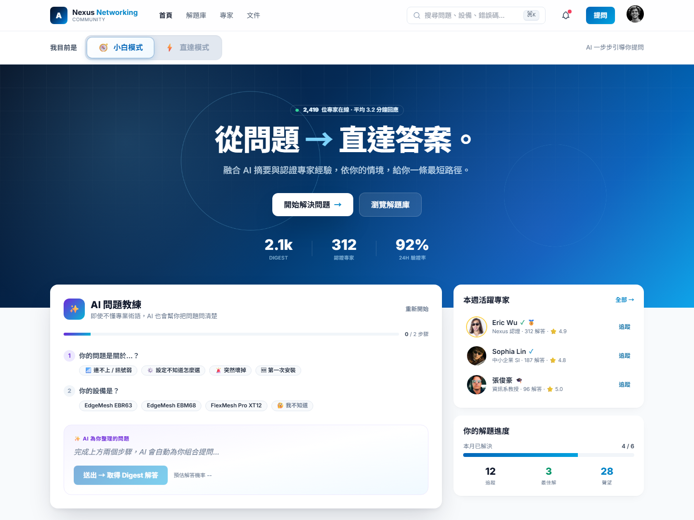
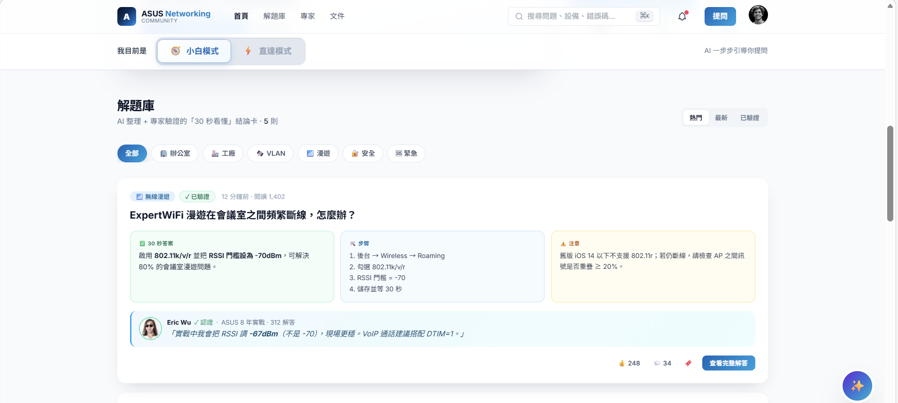
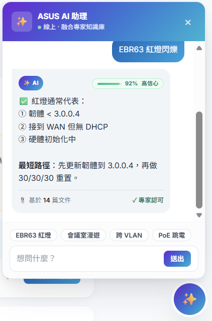

# Nexus Enterprise Networking · Community Platform Prototype

> 一個從 **Persona C「直達哥」** 出發、依 **Day 2 Surprise Insights** 反覆迭代的 HTML 原型。
> 融合 **AI 摘要** 與 **認證專家經驗**，依使用者情境給出最短解題路徑。

<p align="center">
  
</p>

---

## 🎯 設計脈絡

| 階段 | 產出 |
|---|---|
| **Day 1** | 依 Persona / POV / HMW 產出第一版原型 |
| **Day 2** | 取得使用者測試的 **Surprise Insights**，重新設計引導體驗 |
| **Post-test** | 依 **Impact / Effort Matrix** 篩出「Do It Right Now」項目，產出 V2 |

### Persona C — 直達哥
- 目標導向、高效率、把論壇資訊當工具使用
- 進論壇只為找答案，不想看閒聊
- 不喜歡資訊分散、不喜歡答案藏太深
- 希望「從問題直接通到答案，中間不要太多岔路」

### Day 2 — Surprise Insights
1. **小白如何問對問題**
2. 使用者其實更在意「簡潔的 Digest 資訊」與「引導」
3. 必須順著使用者的思維協助找到答案
4. 原以為只有專家會用，但事實上也有沒有 Domain Know-How 的使用者
5. 如何更好融合 AI × 專家知識，依不同情境提供不同引導體驗

---

## ✨ 主要功能

### 1. 雙模式切換（小白 / 直達）
頁面頂部 sticky band，永遠可見。一鍵切換完全不同的工作面板。

### 2. AI 問題教練（小白模式）
不知道怎麼問？三步驟引導 → AI 自動組合出完整提問句。

### 3. 關鍵字直達面板（直達模式）
深色高效率介面，10 個熱門關鍵字 chip + 已驗證最短解答表（不顯示專家名稱，呼應「直達哥不想與專家互動」）。

<p align="center">
  
</p>

### 4. Digest 解題卡
三欄式結論：**✅ 30 秒答案 / 🛠️ 步驟 / ⚠️ 注意**。卡片中段「**專家簡評**」醒目區拉出實戰 quote。

### 5. AI vs 專家對照 Modal
同一個問題，左 AI（信心 %）/ 右專家（Best Answer），底部「Best of Both」融合建議。

### 6. AI 助理（含信心度）
右下角常駐 ✨ 氣泡。每個回答都標示**可信度（高/中/低）**：
- **高信心 (≥ 85%)**：綠色 + 顯示「✓ 專家認可」
- **中信心 (70-84%)**：琥珀色 + 標示「尚未驗證」
- **低信心 (< 70%)**：紅色 + **自動跳出「轉接專家」CTA**

<p align="center">
  
</p>

---

## 🚀 如何使用

雙擊 `nexus-community-prototype.html` 即可在瀏覽器中開啟（需網路連線載入 Tailwind / Google Fonts / Pravatar CDN）。

### URL 參數（debug 用）
| 參數 | 效果 |
|---|---|
| `?notour=1` | 跳過首次導覽 |
| `?direct=1` | 直接進入直達模式 |
| `?compare=1` | 開啟 AI vs 專家對照 modal |
| `?copilot=1` | 開啟 AI 助理面板 |
| `?demo=high\|mid\|low` | 在 AI 助理裡 demo 三種信心度回應 |

---

## 📂 檔案結構

```
DT/
├── nexus-community-prototype.html      ← V2 最新版（依 Matrix 改版後）
├── nexus-community-prototype-v1.html   ← V1 備份（改版前）
├── screenshots/
│   ├── 01-hero-mode-coach.png
│   ├── 02-digest-library.png
│   └── 03-ai-confidence.png
├── .gitignore
└── README.md
```

---

## 🛠 技術棧
- **HTML5** + **Tailwind CSS** (CDN, JIT)
- 純 **JavaScript**（無框架、無 build 步驟）
- 字型：**Inter** + **Noto Sans TC**
- 響應式：**375px** → **1440px+**

---

## 📐 響應式斷點
| 斷點 | 寬度 | 主要變化 |
|---|---|---|
| Mobile | 375 - 639px | 全堆疊、header 縮減、字級降一級 |
| Tablet | 640 - 1023px | 顯示頂部搜尋，hero 仍置中 |
| Desktop | 1024 - 1439px | 雙欄 8+4 grid，full nav |
| Wide | 1440px+ | 同 desktop，更多留白 |

---

## 💡 V1 → V2 改版重點（依 Impact/Effort Matrix）

### 🔥 Do It Right Now（執行）
- ✅ 移除直達模式自有搜尋框（全站只剩 ⌘K 一處）
- ✅ 直達模式改為**關鍵字 chip 驅動**
- ✅ 直達模式移除專家姓名欄
- ✅ Digest 卡新增「專家簡評」醒目區
- ✅ 簡化字體階層
- ✅ 模式切換移到頁面頂部 sticky band（更早被看到、放大）

### 📋 Project（未做）
- 文章分類對小白簡化

### 🚫 Ignore
- Tour modal、對焦中間、專家 Profile 像 104 → 不動

---

## 📝 設計反思
> 不只專家，也陪伴每一位小白。

使用者橫跨從 Domain 專家到完全沒背景的新手——這意味著「一個介面 fits all」不會成功。
解法是：**用同一個內容架構，提供兩種引導密度**。
- 小白 → AI 主導 + 步驟引導
- 直達 → 關鍵字主導 + 跳過引導
- 兩邊都用同一套 Digest 內容、同一套專家驗證機制

AI 不是要取代專家，而是當專家不在線時的「第一線回答」；當 AI 信心低時，主動把使用者交給專家。**這才是 AI × 專家融合的真正意義。**

---

Made with [Claude Code](https://claude.com/claude-code) · 2026
